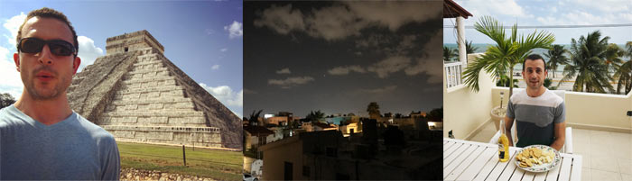

This is what I'm up to lately, both personally and professionally. The [Now page](http://nownownow.com/about) concept inspired by [Derek Sievers](https://sivers.org/now).

**Last Updated** 
December 3, 2016

**Current City** 
Lawrence, Kansas

## Employment

Working remotely for contract clients in bio-medical research, over-the-road trucking, higher education. Mostly working from home or coffee shops in Kansas, occasionally from more interesting places.

I am not currently taking on any new software development projects or clients.

I recently relinquished my title of "Co-Organizer" within the [Lawrence Coders User Group](https://www.meetup.com/Lawrence-Coders/). My involvement within the last 12 months has waned due to life and work commitments, and I was not prioritizing group involvement. I will still attend when convenient for my schedule and hope my vacancy will provide room for others to step up their involvement. Aaron and Kevin are doing great work for the Lawrence development community.

My mother's health has improved to where I and her are comfortable with me traveling for longer periods of time. In 2017 I will return to working remotely from various locations not-in-Kansas, perhaps a few weeks at a time. Some plans already solidified. See below.

## Current Experiments

**Reading children's books on YouTube**. I have been yearning for a side project not related to software development and like the idea of reading children's books on YouTube. Many people have said my voice is soothing and relaxing, while children's books are an innocent indulgence from self-inflicted busy lives. I hope voicing these books will offer a few minutes of zen and escapism to both adults and children listeners. I have recorded a set of pilots and will post them soon. I'm stuck on the idea of branding but should stop making that an excuse for not publishing. In fact I'll publish all of them after publishing this update.

**Social media hiatus.** After the Presidential Election in November I went on a mostly-hiatus from reading Facebook and Twitter. I discovered I felt much happier without a list of unread updates and doom-and-gloom nature of content coming my way. (Perhaps I need to further recalibrate my connections.) Instead I consciously seek the voices I want to hear from instead of passively taking in time-series content. My hiatus will continue through December.

**Reading more books.** My reading has picked up since getting my first Kindle, a Paperwhite, in October. I feel more satisfied reading books than Twitter, Hacker News, Reddit and blogs. Some friends have recently posted their [reading](https://aaronsumner.com/pages/reading.html) [lists](http://www.ericjgruber.com/blog/listens/). Inspired, I will do the same. Not for anyone else, but the list's public presence will hold me accountable.

**Rediscovering Metallica.** Metallica is my all-time favorite band. A friend introduced me to The Black Album on cassette for my 10th birthday and I've been hooked on heavy metal music since. In November, Metallica released their first new album in eight years: [Hardwired... to Self-Destruct](https://www.youtube.com/watch?v=uhBHL3v4d3I&list=RDuhBHL3v4d3I#t=2). And it's solidly reminiscent of their older style. Remastered recordings of [Kill 'Em All and Ride The Lightning](https://metallica.com/blog/news/384030/kill-em-all-ride-the-lightning-remastered-reissued) came out in February 2016 and sound fantastic.

## Recent Travel

**Cancun, Mexico; November 2016.** Five days for a disconnected vacation. A friend I went with had been there several times before. My first time in Mexico was enjoyable for the warm weather and friendly locals, but the tourist-centric nature of Cancun wasn't my ideal. While we stayed in AirBNB-booked condos the popular areas are consumed by tourism and quintessential vacationers. Next time in the Yucatan Peninsula I'll look for more secluded accommodations.

## Upcoming Travel

**Costa Rica, January 2017.** I'll be one of eighteen people living and working remotely from Playa Hermosa, Costa Rica (Pacific side) as part of a [Nomad House retreat](https://nomadhouse.io/retreats/costa-rica). There I'll be part-time working remotely with my normal contracting clients and adventuring the rest.

**Europe, later part of 2017.** Some friends will be traveling throughout eastern Europe sometime in the second half of 2017. We'll rendezvous, work remotely and explore.
